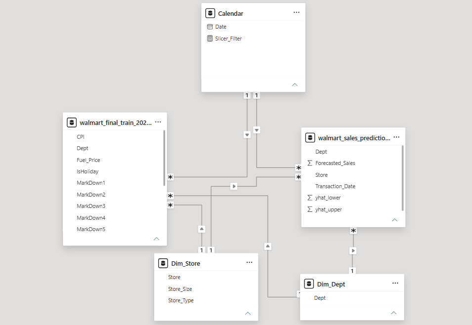

# Data Architecture: Multi-Fact Star Schema Blueprint

## Overview
The data model for this project utilizes an advanced **Multi-Fact Star Schema** architecture. This design is strategically engineered to handle the separation of concerns between raw historical transactions and machine learning predictive inferences, maximizing query performance and ensuring data integrity within the Power BI VertiPaq engine.

## Schema Diagram

## Model Components

### 1. Fact Tables (Multi-Fact Layer)
This architecture implements a dual-fact table design. Both tables share identical grains, allowing them to coexist seamlessly within the same analytical context.

#### A. Historical Fact Table (`walmart_final_train_202605212105`)
- **Grain:** Singular weekly intersection of `Store`, `Dept`, and `Date`.
- **Key Metrics:** `Weekly_Sales` (Actual ground-truth revenue).
- **Role:** Central repository for all historical transactional data used to train the machine learning models and serve as the baseline for visual trend comparisons.

#### B. Forecast Fact Table (`walmart_sales_predictions_murni_future`)
- **Grain:** Identical alignment with historical grain (`Store`, `Dept`, and `Date`) stretching across the 12-week future horizon.
- **Key Metrics:** - `Forecasted_Sales` (Point forecast derived from FB Prophet inference).
  - `yhat_lower` (Statistical lower boundary of the confidence interval).
  - `yhat_upper` (Statistical upper boundary of the confidence interval).
- **Role:** Central repository for future demand signals, feeding the prediction line curve and uncertainty error bands on the time-series visualization.

---

### 2. Dimension Tables (Conformed Dimensions)
Dimension tables act as the entry points for filtering and slicing the fact metrics. Because both fact tables connect to these exact dimensions, they are classified as **Conformed Dimensions**.

- **`Dim_Store`**: Master reference for store location and attributes. Contains unique `Store` keys.
- **`Dim_Dept`**: Master reference for department hierarchy and classifications. Contains unique `Dept` keys.
- **`Calendar` (Time Intelligence)**: The temporal backbone of the schema. Contains fiscal/standard date hierarchies to enable continuous time-series analysis across both historical and future boundaries.

---

## Relational Integrity & Filter Propagation

The structural topology enforces strict relational rules to guarantee calculation predictability:

* **Relationship Type:** One-to-Many ($1 \rightarrow *$) from Dimension tables to both Fact tables.
* **Cardinality Constraints:** Master keys in Dimension tables are guaranteed unique (1), while Fact tables allow multiple transactional entries over time ($*$).
* **Cross-Filter Direction:** Standardized to **Single Direction** (pointing downward: Dimension $\rightarrow$ Fact). This architecture prevents ambiguous multi-path routing, eliminates data inflation bugs, and optimizes DAX evaluation times during runtime slicer interactions.

---

## Architectural Advantages

1. **Query Optimization & Star Schema Efficiency:** Decoupling descriptive dimensions from transactional metrics minimizes table width, allowing the VertiPaq columnar database to highly compress data blocks and execute blazing-fast memory lookups.
2. **Conformed Dimension Synergy:** Having both historical sales and future predictions share the same dimension hooks allows a single slicer selection (e.g., filtering `Store = 13`) to simultaneously slice both fact tables without breaking the layout.
3. **Robust UX & Performance Stability:** Utilizing a strict Star Schema eliminates the need for bidirectional relationship filters ($1 \leftrightarrow *$), ensuring that front-end dashboard components remain responsive and lightweight under heavy cross-filtering activities.